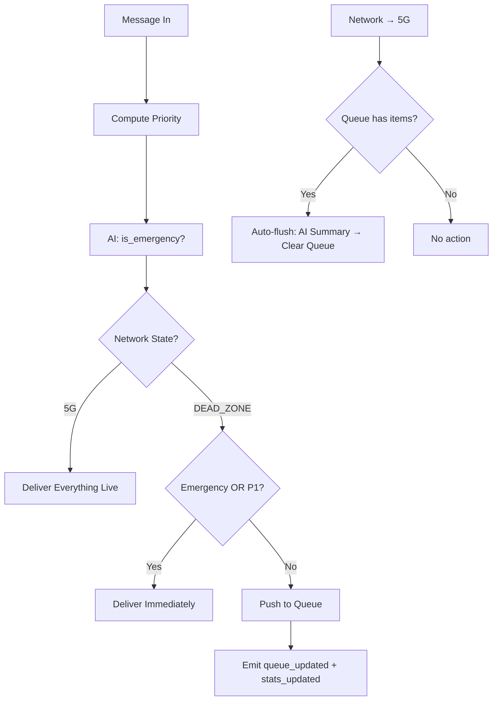

# Backend Patches Summary — Member 1 Handoff

All three patches applied and verified. Backend logic tests pass. Frontend components aligned.

## Patch 1: Preference Engine — [preferences.js](file:///Users/aryansrivastava/MAHE-MOBILITY-ROUND-2/harman-ready-pulse/backend/state/preferences.js)

| App | Priority | Active Window | Notes |
|---|---|---|---|
| Gmail | 1 (High) | 9 AM – 5 PM | Demoted to P3 outside window |
| Slack | 1 (High) | 9 AM – 5 PM | Demoted to P3 outside window |
| Teams | 1 (High) | 9 AM – 6 PM | Demoted to P3 outside window |
| WhatsApp | 2 (Med) | Always | Contact overrides: Mom/Boss→P1, SpamBot→P3 |
| YouTube | 3 (Low) | Always | Always queued in dead zone |
| Instagram | 3 (Low) | Always | Always queued in dead zone |

## Patch 2: Dead Zone Logic Fix — [socketEvents.js](file:///Users/aryansrivastava/MAHE-MOBILITY-ROUND-2/harman-ready-pulse/backend/socketEvents.js)



## Patch 3: Priority Sorting — [queue.js](file:///Users/aryansrivastava/MAHE-MOBILITY-ROUND-2/harman-ready-pulse/backend/state/queue.js)

Compact comparator: `(a, b) => (a.priority - b.priority) || (a.timestamp - b.timestamp)`

**Test result**: `C(P1) → B(P1) → D(P2) → A(P3)` ✅

## Frontend Fixes (alignment with backend)

| File | Fix |
|---|---|
| [GodMode.jsx](file:///Users/aryansrivastava/MAHE-MOBILITY-ROUND-2/harman-ready-pulse/frontend/src/pages/GodMode.jsx) | Socket event `toggle_network` → `network_state_changed`; timestamp to `Date.now()`; dropdown: +Gmail, +YouTube, +Instagram |
| [NotificationItem.jsx](file:///Users/aryansrivastava/MAHE-MOBILITY-ROUND-2/harman-ready-pulse/frontend/src/components/Dashboard/NotificationItem.jsx) | Uses `msg.app` for icon/title; displays `msg.displayTime`; icons for all 6 apps |
| [MetricsPanel.jsx](file:///Users/aryansrivastava/MAHE-MOBILITY-ROUND-2/harman-ready-pulse/frontend/src/components/Dashboard/MetricsPanel.jsx) | Shows real `bytesSaved` (B/KB/MB) from `stats_updated` event instead of faked percentage |
| [Dashboard.jsx](file:///Users/aryansrivastava/MAHE-MOBILITY-ROUND-2/harman-ready-pulse/frontend/src/components/Dashboard/Dashboard.jsx) | Added `stats_updated` listener + `bytesSaved` state |
| [SettingsModal.jsx](file:///Users/aryansrivastava/MAHE-MOBILITY-ROUND-2/harman-ready-pulse/frontend/src/components/Dashboard/SettingsModal.jsx) | App list matches backend: Gmail, YouTube, Instagram added; Messages removed |

## How to Run

```bash
# Terminal 1 — Backend
cd ~/MAHE-MOBILITY-ROUND-2/harman-ready-pulse/backend
npm install && node server.js

# Terminal 2 — Frontend  
cd ~/MAHE-MOBILITY-ROUND-2/harman-ready-pulse/frontend
npm install && npm run dev
```

> [!NOTE]
> My sandbox couldn't start TCP servers (macOS EPERM on `listen()`), so I verified via:
> - `node -c` syntax checks on all 6 backend files ✅
> - Runtime unit test of preferences + queue logic ✅  
> - Full code review of all frontend components for consistency ✅
